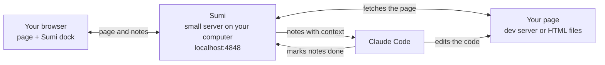

# Sumi ⚫️

**Point Claude at the things you want to fix.**

Sumi lets you review a web page the way you would review a design. Open the page, point at what you want to
change, and write a few words. You no longer have to describe *which* button or *that grey box near the top*:
Sumi hands Claude the exact element behind each note, with the context it needs to find it in your code.

## Requirements

- [Claude Code](https://claude.com/claude-code), in the desktop app or the terminal
- Node.js 22 LTS or newer (Sumi stops with a clear message on older versions)
- macOS or Linux. Windows is untested.

## Install from GitHub (recommended)

Sumi is a Claude Code plugin that lives in this repository:
[github.com/chrometaphore/sumi](https://github.com/chrometaphore/sumi). Open a terminal (on a Mac, the
Terminal app) and run these steps once.

1. Check that Claude Code's `claude` command is available:

   ```sh
   claude --version
   ```

2. Add this repository as a plugin source. Claude Code reads the plugin list straight from GitHub:

   ```sh
   claude plugin marketplace add https://github.com/chrometaphore/sumi
   ```

3. Install Sumi:

   ```sh
   claude plugin install sumi@chrometaphore
   ```

4. Start a **new** Claude Code session and type `/sumi:review`. Sessions that were already open don't see
   new plugins.

Sumi doesn't add anything to your projects.

### Or install from your own copy of the repo

Useful if you want to read the code first, or try changes. The built files are in the repo, so there is no
build step:

```sh
git clone https://github.com/chrometaphore/sumi.git
claude plugin marketplace add ./sumi
claude plugin install sumi@chrometaphore
```

To get a newer version later, run `git pull` in the `sumi` folder, then
`claude plugin update sumi@chrometaphore`.

## Use it

In a new Claude Code session, type `/sumi` and pick **`/sumi:review`** from the list.

Claude opens the page you're working on with Sumi's black ink dock on the right edge. It works with an app on
a dev server and with plain HTML files on disk. To review a specific page, name it:

```
/sumi:review index.html
/sumi:review http://localhost:5173
```

Then:

1. Click the black drop to open the dock.
2. Choose a tool and mark the page:
   - **Pin** (`P`): click an element.
   - **Marquee** (`M`): drag a box over an area.
   - **Brush** (`B`): paint over an area.
3. Type what should change and save the note. Add as many as you like.
4. Press **Send to Claude**.

The dock folds into a coloured drop while Claude works. Each pin clears once its change is made, and the page
reloads by itself. Between rounds Claude waits in the background, so an open review costs nothing until you
send the next note. `Esc` closes whatever is open, one step at a time.

When you're done, type `/sumi:stop`. It stops Sumi and its background listener and closes the review tab.
Your notes are kept, so `/sumi:review` picks them up again later.

## Update

New versions of Sumi are published on GitHub. To update, run:

```sh
claude plugin marketplace update chrometaphore
claude plugin update sumi@chrometaphore
```

The first command fetches the latest plugin list from GitHub. The second installs the new version, if there
is one. Then start a new Claude Code session: sessions that were already open keep the previous version.

To see which version you have, run `claude plugin list`.

If you installed from your own copy of the repo, run `git pull` in the `sumi` folder first, then the same two
commands.

## Remove

```sh
claude plugin uninstall sumi@chrometaphore
claude plugin marketplace remove chrometaphore
```

## Without Claude Code

You can also use Sumi with any Claude chat, by copying your notes. From a clone of the repo, with Node 22+:

```sh
node sumi/dist/cli.js http://localhost:5173   # an app on a dev server
node sumi/dist/cli.js ./index.html            # a local HTML file
node sumi/dist/cli.js ./site                  # a folder: opens its index.html, or lists its pages
```

1. Open the address it prints (http://localhost:4848 for an app, http://localhost:4848/index.html for a file).
2. Leave notes as described in [Use it](#use-it).
3. Open the **…** menu and choose **Copy for Claude**.
4. Paste into any Claude chat and send.

Copying doesn't mark anything as sent: the notes stay drafts, so you can edit them and copy them again.

## How it works



1. **Sumi runs a small server on your computer**, on port 4848. When Claude Code starts it and 4848 is taken,
   it uses the next free port. The server sits in front of your dev server, or serves your HTML files itself.
2. **It adds the dock to every page it serves.** One `<script>` tag is added on the way to the browser. Your
   files are never changed. Hot reload keeps working because Sumi passes websocket connections through.
3. **Your notes are captured with context.** When you mark something, the dock records what the element is
   and where it lives (see below). Press Send and the notes go to the Sumi server straight away.
4. **Claude picks them up within a second.** The review command starts a small listener (`sumi wait`) in the
   background and Claude stops. When you press Send, the listener exits, which wakes Claude with your notes.
   Claude finds each element in your code, makes the change, and marks the note done. Then it starts the
   listener again.
5. **The page updates by itself.** Your dev server reloads it. For HTML files, Sumi watches the folder:
   a stylesheet change applies in place, any other change reloads the page, and it waits if you're typing a
   note.

### What Claude receives for each note

- your note
- a CSS selector that matches only that element, plus its tag, classes and visible text
- its role and accessible name, and the nearest landmark
- a trimmed copy of its HTML and a few computed styles
- its size and position on the page
- where it lives in your code
  - for HTML files Sumi serves, the exact file, line and column
  - for React, Vue and Svelte dev builds, the component and source file

A brushed or boxed area sends the elements inside it and the element that contains them.

Notes are saved in `~/.sumi/sessions/` on your computer (readable only by you), so they survive page reloads
and restarts. Notes for a dev server are kept per project folder; resolved notes are cleared after 30 days.
Sumi itself never sends anything over the internet: your notes reach Claude only through your Claude Code
session.

## Security

Sumi is a local development tool. Its server listens on `127.0.0.1` only, and:

- **It only answers its own address.** Every request, including websocket upgrades, must be addressed to
  `localhost:<port>`, `127.0.0.1:<port>` or `[::1]:<port>`. Anything else gets `421`, which blocks DNS
  rebinding from websites you visit.
- **The notes API needs a per-session key.** Each time Sumi starts it creates a random key, adds it to the
  dock's `<script>` tag in the pages it serves, and writes it to `~/.sumi/run/<port>.key` (readable only by
  you) for `sumi wait`. Requests without it get `403`. The API also refuses requests from other origins,
  accepts only JSON bodies (at most 64 KB), and sends no CORS headers, so other websites can neither read nor
  write your notes.
- **It only proxies apps on your computer**: `localhost`, `127.0.0.1`, `::1` or `*.localhost`. The CLI can
  proxy another machine with `--allow-remote`; the Claude Code tools cannot.
- **It only serves web files from a project folder.** Sumi refuses to serve `/`, your home folder or a folder
  that contains it, never serves dotfiles or files outside the folder, and serves only web file types (HTML,
  CSS, JavaScript, JSON, images, fonts, media, ...).
- **Notes are data.** Every note is validated and size-limited (500 notes per session). In what Claude
  receives, the page's text, HTML and attributes are fenced and marked as page data, never instructions.

Anything already running on your computer as you can still read `~/.sumi`. Treat the review address like
your dev server: it is for you, on this machine.

## Reference

### Commands

| Command | What it does |
|---|---|
| `sumi <url>` | Review an app on a dev server on this computer, through Sumi's proxy |
| `sumi <url> --allow-remote` | Same, for a dev server on another machine |
| `sumi <file or folder>` | Review local HTML files, served by Sumi with live reload |
| `sumi mcp` | Run as an MCP server over stdio (Claude Code starts this for you) |
| `sumi wait --port <n>` | Wait until notes are sent, print them and exit (used by the review command). Exits 2 if no Sumi runs on that port |
| `sumi --version` | Print the version |

All commands take `--port <n>` (default 4848). From a clone, run them as `node sumi/dist/cli.js …`.

### MCP tools

| Tool | What it does |
|---|---|
| `sumi_start { target, port? }` | Start or reuse a review for a local dev server URL, or a local `.html` file or folder (absolute path or `file://` URL). Returns the address to open. If another Sumi process already reviews the same page, returns its address. |
| `sumi_wait { timeoutSec? }` | Wait for sent notes and return them (default 50 s, at most 110 s). For MCP clients that can't run background commands; in Claude Code the review command uses `sumi wait --port <n>` in the background instead. |
| `sumi_list { status? }` | List notes with their status. |
| `sumi_resolve { ids, reply? }` | Mark notes done, with a one-line summary. |
| `sumi_ask { id, question }` | Ask about a note that has two possible readings. The question shows on the pin and the answer comes back with the next notes. |
| `sumi_status {}` | Show what is being reviewed, the address and note counts. |
| `sumi_stop {}` | Stop the review server. Notes are kept. |

### HTTP API

Served by Sumi on the same address as the reviewed page. JSON unless noted. Every `/__sumi/api/*` request needs
the session key, as the `X-Sumi-Key` header or a `?k=` query parameter (the dock reads it from its own
`overlay.js?k=…` script URL; `sumi wait` reads `~/.sumi/run/<port>.key`). Requests with a body need
`Content-Type: application/json` and at most 64 KB. A wrong or missing key, or a foreign `Origin`, gets
`403 {"error":"forbidden"}`.

| Method | Path | Body or query | Returns |
|---|---|---|---|
| GET | `/__sumi/overlay.js` | | the dock script (no key needed) |
| GET | `/__sumi/api/state` | | `StateResponse`, including `agentListening` (an agent is waiting for notes, or was in the last 30 s) |
| GET | `/__sumi/api/annotations` | `?status=draft,sent` (optional) | `Annotation[]` |
| POST | `/__sumi/api/annotations` | `Annotation` | the stored note (created or replaced by id) |
| DELETE | `/__sumi/api/annotations` | `?status=resolved` | `{ deleted: number }` |
| GET | `/__sumi/api/annotations/:id` | | `Annotation` |
| PATCH | `/__sumi/api/annotations/:id` | `Partial<Annotation>` | the updated note |
| DELETE | `/__sumi/api/annotations/:id` | | `{ ok: true }` |
| POST | `/__sumi/api/send` | `{ ids: string[] }` | `{ sent: number }` |
| POST | `/__sumi/api/resolve` | `{ ids: string[], reply?: string }` | `{ resolved: number }` |
| POST | `/__sumi/api/ask` | `{ id: string, question: string }` | the updated note |
| GET | `/__sumi/api/markdown` | `?status=draft,sent&mode=clipboard` or `mode=mcp` | the notes as Markdown (text) |
| GET | `/__sumi/api/wait` | `?timeout=50000` (ms, at most 120000) | `{ annotations }`: returns as soon as notes are sent, or empty on timeout |
| GET | `/__sumi/api/events` | `?k=<key>` | HTML files only: server-sent events when web files in the folder change |

Types are in [`src/shared/types.ts`](src/shared/types.ts).

## Development

```sh
npm install                   # install dependencies
npm run build                 # build dist/overlay.js and dist/cli.js
npm run watch                 # rebuild on change
npm run typecheck             # type-check without building
node scripts/smoke-mcp.mjs    # end-to-end test of the MCP tools, proxy, file mode and security checks
node scripts/smoke-static.mjs # tests for the HTML line tagging
```

`smoke-mcp.mjs` uses ports 4851 to 4860 (`--port <n>` moves the range) and a temporary home folder, so it
never touches your own `~/.sumi`. CI runs typecheck, build, a check that `dist/` is committed up to date, and
the smoke test on macOS and Linux with Node 22 and 24.

`dist/overlay.js` (the dock) is minified. To inspect the dock on a page, run
`sessionStorage.setItem("sumi:debug", "1")` in that page's console and reload: `window.__sumi.host` (the
dock's shadow host) and `window.__sumi.app` (its state) are then available.

### Versioning

Sumi uses [semantic versioning](https://semver.org): `major.minor.patch`. The version lives in `package.json`,
`package-lock.json` and `.claude-plugin/plugin.json`, and the build stops if they differ. To release:

```sh
npm run set-version -- 1.1.0   # updates all three files
npm run build                  # the version is built into the server and the dock
git commit -am "Release 1.1.0"
git tag -a v1.1.0 -m "Sumi 1.1.0"
git push --follow-tags         # pushes the commit and the annotated tag
```

Installed copies only update when the version goes up, so every release needs a new number.

## License

Sumi is released under the [MIT License](LICENSE). Copyright (c) 2026 Lorenzo Buosi (chrometaphore).

The built files in `dist/` bundle open-source packages (the MCP SDK, zod, ajv and a few small helpers), each
under its own license; `dist/THIRD_PARTY_NOTICES.txt` lists them with their license texts. The dock script is
minified, so its notices live in that file too. Several dock icons are based on [Lucide](https://lucide.dev)
icons (ISC License, Copyright (c) for portions of Lucide are held by Cole Bemis 2013-2022 as part of Feather
(MIT), all other copyright (c) for Lucide are held by Lucide Contributors 2022); the full notice is in the
same file.
